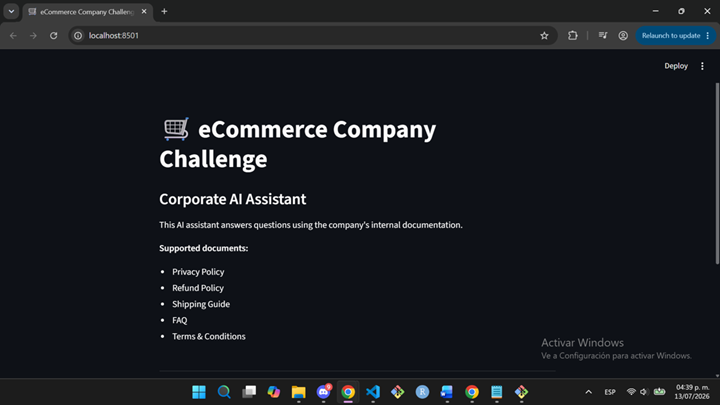
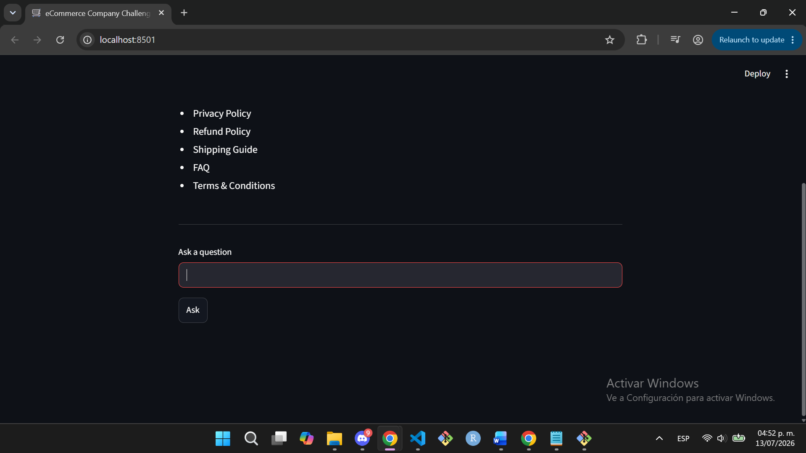
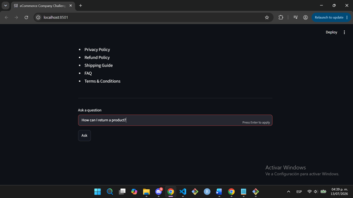
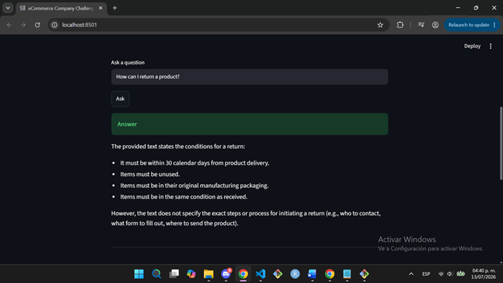
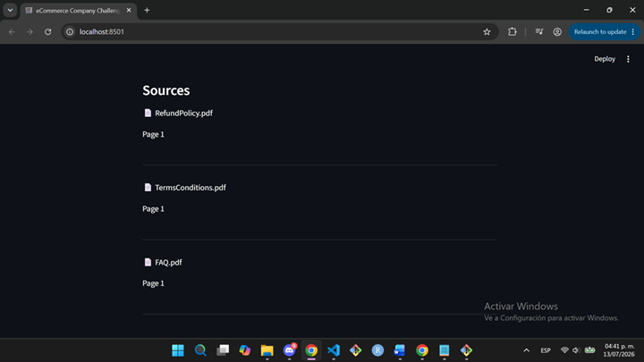

# ecommerce-company-challenge
AI-powered Enterprise Knowledge Assistant using Retrieval-Augmented Generation (RAG) to answer questions over internal e-commerce documentation.

## Project Progress
✅ Document Collection
✅ PDF Loading
✅ Text Extraction
✅ Chunk Generation

## Project Progress
✅ Document Collection
✅ PDF Loading
✅ Text Extraction
✅ Chunk Generation
✅ Embedding Generation (HuggingFace Local)
✅ FAISS Vector Database
✅ Semantic Search & RAG Agent (Gemini 2.5 Flash)

## Current Features

✅ PDF document ingestion (PyPDF)
✅ Automatic text extraction
✅ Chunk generation (RecursiveCharacterTextSplitter)
✅ Metadata preservation
✅ Vector database (FAISS Local Storage)
✅ Semantic search & retrieval
✅ Retrieval-Augmented Generation (RAG) using Google Gemini 2.5 Flash
✅ Source citation and auditing logs

## Example Questions

✅ How can I return a product?
✅ What is the refund policy?
✅ How long does shipping take?
✅ How is customer information protected?
✅ Can I cancel an order?

## 🛒 Interactive Web Interface (Streamlit)

The graphical user interface (GUI) has been successfully implemented in the browser, migrating the query workflow from the terminal console to an interactive and optimized web application.

### Core UI Features:
✅ **Query Input Box ("Ask a question"):** Sanitized input field that securely validates that the user enters text before processing the query pipeline.
✅ **Action Button ("Ask"):** Execution trigger coupled directly with the RAG backend core.
✅ **Dynamic Loading Spinner:** Interactive visual response (`Searching documentation...`) during semantic and vector processing.
✅ **Source Audit Display:** Automated metadata mapping that extracts the source PDF filename and its corresponding real page number.

### Optimization & Performance:
✅ **Resource Caching:** Implementation of Streamlit's `@st.cache_resource` decorator on the agent loader, freezing PDF parsing and vector indexing within **FAISS** in memory. This prevents embedding recalculation on a per-query basis, reducing response latency to milliseconds and optimizing **Google Gemini 2.5 Flash** API quota consumption.

### 📸 Application Screenshots (UI Proof of Concept)

Below are the visual evidences of the working RAG Agent inside the web browser:

#### 1. Initial Interface & Main Dashboard
✅ *Dashboard layout displaying the supported corporate documents list.*

#### 2. Safe Input Validation Error
✅ *UI error warning triggered when clicking the "Ask" button with an empty query box.*

#### 3. Live Question Processing
✅ *Example of typing a question inside the text field before sending the execution trigger.*

#### 4. AI Generated Answer
✅ *Successful response generated by Gemini 2.5 Flash inside the application container.*

#### 5. Document Sources Audit Detail
✅ *Extended vertical view showcasing the metadata mapping (source PDF names and exact page citations) extracted from FAISS.*
