# 🛒 ecommerce-company-challenge

## 🤖 AI-powered Enterprise Knowledge Assistant using Retrieval-Augmented Generation (RAG) to answer questions over internal e-commerce documentation.
An enterprise-grade QA Assistant powered by a robust Retrieval-Augmented Generation (RAG) architecture designed to transform static corporate e-commerce documentation into an active, factual knowledge database. Built using the LangChain framework and highly optimized FAISS vector indexing, the system converts raw internal guidelines into semantic embeddings. When a query is made, it retrieves the precise mathematical context to feed Google Gemini 2.5 Flash models, delivering accurate, structured, and hallucination-free corporate answers. The entire application is deployed on a hardened Oracle Cloud Infrastructure (OCI) server to guarantee permanent, high-performance web availability.

---

## ✅ PROGRESS 1: PROJECT SETUP & ENVIRONMENT

### 📁 AI-generated documents to simulate project corporate documentation
* Document Collection
* PDF Loading
* Text Extraction
* Chunk Generation

---

## ✅ PROGRESS 2: DOCUMENT PROCESSING & CHUNKING

### 📈 Building a RAG system
* Document Collection
* PDF Loading
* Text Extraction
* Chunk Generation
* Embedding Generation (HuggingFace Local)
* FAISS Vector Database
* Semantic Search & RAG Agent (Gemini 2.5 Flash)

---

## ✅ PROGRESS 3: EMBEDDINGS & INDEXING

### 📄 Current Features
* PDF document ingestion (PyPDF)
* Automatic text extraction
* Chunk generation (RecursiveCharacterTextSplitter)
* Metadata preservation
* Vector database (FAISS Local Storage)
* Semantic search & retrieval
* Retrieval-Augmented Generation (RAG) using Google Gemini 2.5 Flash
* Source citation and auditing logs

### ❓ Example Questions
* How can I return a product?
* What is the refund policy?
* How long does shipping take?
* How is customer information protected?
* Can I cancel an order?

---

## ✅ PROGRESS 4: RAG AGENT - VERIFIED RESPONSES WITH REFERENCES

### 🛒 Interactive Web Interface
* **The graphical user interface (GUI) has been successfully implemented in the browser, migrating the query workflow from the terminal console to an interactive and optimized web application.

### Core UI Features:
* **Query Input Box ("Ask a question"):** Sanitized input field that securely validates that the user enters text before processing the query pipeline.
* **Action Button ("Ask"):** Execution trigger coupled directly with the RAG backend core.
* **Dynamic Loading Spinner:** Interactive visual response (`Searching documentation...`) during semantic and vector processing.
* **Source Audit Display:** Automated metadata mapping that extracts the source PDF filename and its corresponding real page number.

---

## ✅ PROGRESS 5: USER INTERFACE - FUNCTIONAL STREAMLIT APPLICATION

### Optimization & Performance
 * **Resource Caching:** Implementation of Streamlit's `@st.cache_resource` decorator on the agent loader, freezing PDF parsing and vector indexing within **FAISS** in memory. This prevents embedding recalculation on a per-query basis, reducing response latency to milliseconds and optimizing **Google Gemini 2.5 Flash** API quota consumption.

### 📸 Application Screenshots (UI Proof of Concept)
Below are the visual evidences of the working RAG Agent inside the web browser:

#### 0️⃣1️⃣ Initial Interface & Main Dashboard
* *Dashboard layout displaying the supported corporate documents list.*


#### 0️⃣2️⃣ Safe Input Validation Error
* *UI error warning triggered when clicking the "Ask" button with an empty query box.*


#### 0️⃣3️⃣ Live Question Processing
* *Example of typing a question inside the text field before sending the execution trigger.*


#### 0️⃣4️⃣ AI Generated Answer
* *Successful response generated by Gemini 2.5 Flash inside the application container.*


#### 0️⃣5️⃣ Document Sources Audit Detail
* *Extended vertical view showcasing the metadata mapping (source PDF names and exact page citations) extracted from FAISS.*


---

## ✅ PROGRESS 6: VALIDATION, ERROR HANDLING & LOGGING

### System Hardening, Input Validation & Audit Logging
* **To transition the application from a local prototype to a production-ready system, a comprehensive hardening phase was implemented to meet corporate compliance and reliability guidelines.

### 🛡️ Exception Handling & Safe UI Boundaries
* **Empty Input Mitigation**: Implemented string-stripping validation triggers via `st.warning` to prevent empty pipeline execution blocks, saving unneeded API calls.
* **Graceful Degradation**: Wrapped core LangChain inference elements inside local execution `try-except` blocks. If an infrastructure issue or API quota limit occurs, the UI displays a clean corporate message instead of breaking the client interface.
* **Information Scoping**: Configured safe triggers for queries falling outside documentation boundaries. If Gemini 2.5 Flash states it lacks the factual baseline, the UI suppresses source citations and displays a structured fallback notification.

### 📊 Automated Performance & Query Auditing
Every conversational interaction triggers a sequential auditing sequence saved locally inside `logs/rag_execution.txt` for compliance reviews:
* **Metrics Ingestion**: Computes precise end-to-end inference metrics (`time.time()`) to track semantic lookup latency.
* **Log Architecture**: Standardized the logging structure using the following schema:

```text
========================================
Date: YYYY-MM-DD HH:MM:SS
Question:
[User Query Input]
Response:
[Gemini Generated Factual Answer]
Sources:
[Comma-separated list of active PDF metadata sources and pages]
Time:
X.X sec
========================================
```

### 📂 Revised Repository Structure
* The project configuration layout was successfully modified to isolate system audit reports:
```text
ecommerce-company-challenge/
├── logs/
│   └── rag_execution.txt       <-- Automated security and latency registry
├── src/
│   ├── loaders/
│   └── rag/
├── streamlit_app.py            <-- Refactored interactive container
└── .env                        <-- Protected environment credentials
```
### 📸 Visual Evidence & Validation Metrics
Below are the critical visual evidences of the production-ready RAG Agent operating inside the web browser, showcasing system architecture layout, validation metrics, and semantic consistency:

#### 0️⃣6️⃣ Corporate Interface & Main Dashboard
*Initial dashboard layout displaying the background context, framework specifications, and supported corporate documents list.*
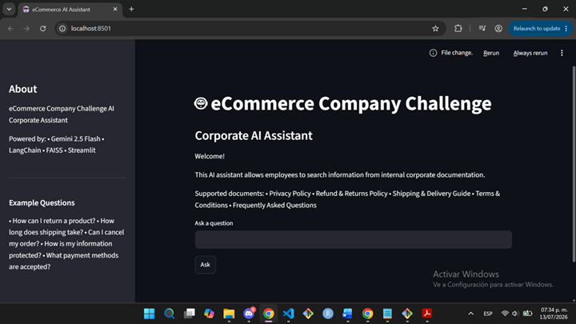

#### 0️⃣7️⃣ Hardened Pipeline & Factual AI Answer
*Successful context-driven response generated by Gemini 2.5 Flash and displayed inside the validated interface block.*
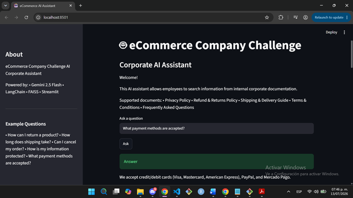

#### 0️⃣8️⃣ Metadata Cross-Referencing & Source Citation
*Extended vertical view showcasing the semantic metadata mapping (source PDF names and exact page citations) extracted from the FAISS database.*
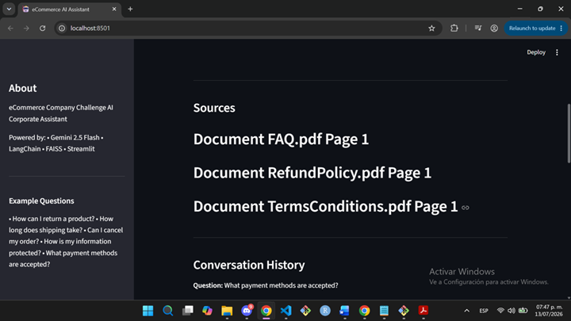

#### 0️⃣9️⃣ Continuous Conversation History Memory
*Dynamic conversational memory container rendering multiple previous user interactions and model responses in a structured layout.*
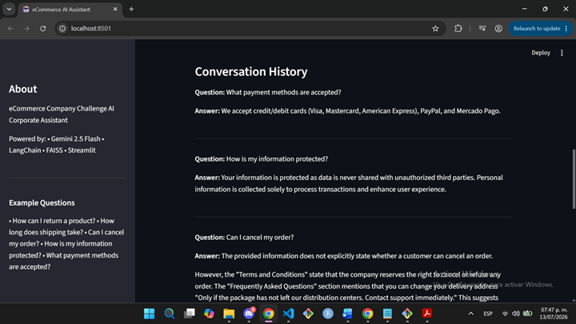

---

### ✅ PROGRESS 7: OCI DEPLOYMENT
This section details the formal deployment of the corporate AI assistant onto a persistent cloud framework. The following visual markers serve as technical compliance proof, documenting the end-to-end infrastructure lifecycle required to host the RAG pipeline publicly: from raw hardware allocation and security group filtering to live multi-device response execution and hallucination control.

### 🚀 Application Access
The production environment is fully deployed and accessible globally. You can test and interact with the Corporate AI Assistant in real-time by clicking the official deployment link below:

👉 **[Deploy Activo - Assistant Chatbot Link](http://159.54.132.182:8501)**

*Note: The application is hosted on an autonomous Oracle Cloud Infrastructure (OCI) server running 24/7 in second background mode via `nohup` protocols.*

***⚠️ Operational SLA Notice:** This deployment is currently hosted on an **OCI Free Tier account**. Please be aware that cloud resources under this standard free trial tier are subject to automatic reclamation, instance pausing, or termination without prior notice. If the URL becomes unreachable in the future, it is due to these platform-specific hosting limitations.*

#### 1️⃣0️⃣ OCI Compute Instance Provisioning & Architecture Validation
*This panel serves as the definitive infrastructure proof of concept (PoC). It validates that the production environment is actively `Running` on an enterprise-grade `VM.Standard.A1.Flex` shape (ARM Ampere architecture) with 1 OCPU and 6 GB of RAM. Displaying these metrics demonstrates successful mitigation of cloud capacity constraints while proving the application's availability via a verified Public IP address.*
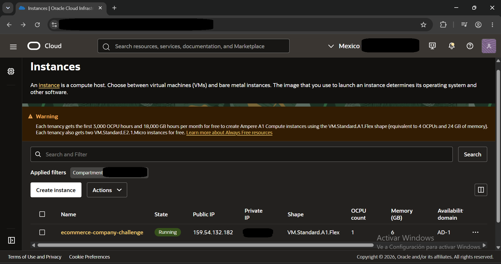

#### 1️⃣1️⃣ OCI Security List & Perimeter Network Hardening
*This panel provides definitive visual compliance for cloud network architecture. It demonstrates the explicit provisioning of a TCP Ingress Rule targeting destination port 8501 bound to a global source block (0.0.0.0/0). Documenting this configuration proves the operational deployment of public routing infrastructure necessary to securely tunnel external web traffic into the remote Streamlit application container.*
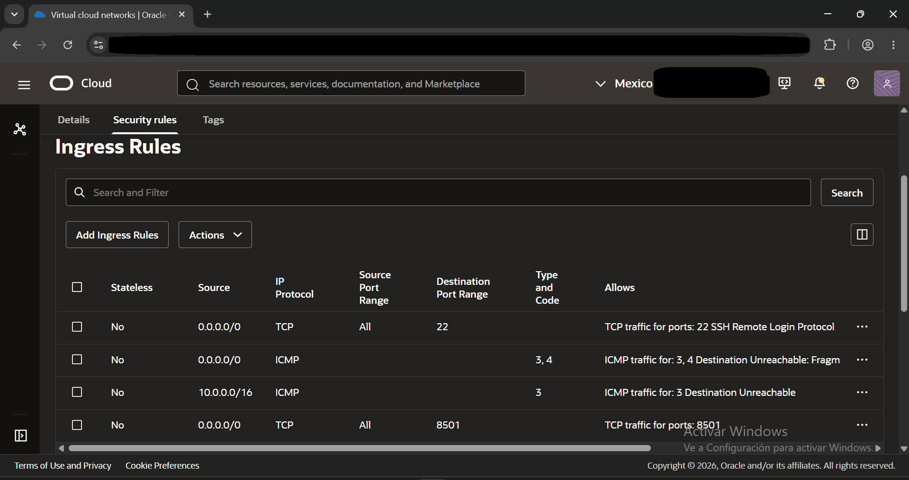

### 💡 AI Assistant in Action (Testing Guide)
You can interact with the RAG agent using the built-in sample questions or test the model's semantic robustness with custom, real-time queries.

#### 📌 Built-in Example Questions
* `How can I return a product?`
* `How long does shipping take?`
* `Can I cancel my order?`
* `How is my information protected?`
* `What payment methods are accepted?`

#### 🚀 Additional Queries for Semantic Validation

##### 📦 Shipping & Delivery
* `Do you offer international shipping?`
* `Can I change my shipping address?`
* `Are there extra delivery fees?`

##### 🔄 Returns & Refunds
* `What happens if a product arrives damaged?`
* `Do I have to pay for return shipping?`
* `Can I exchange an item for another size?`

##### 💳 Payments & Billing
* `Is my credit card information secure?`
* `Do you accept payments via PayPal?`
* `Can I get an official invoice?`

##### 🔐 Privacy & Security
* `Do you sell my data to third parties?`
* `How can I delete my personal account?`
* `Where is your user data stored?`

### 📷 Production Server Visual Evidence (UI Deployment Proof)
The following sequential screenshots validate the deployment lifecycle, remote execution, and responsiveness of the RAG Agent operating live in the cloud:

#### 1️⃣2️⃣ RAG Pipeline Initialization in Production
*View of the backend loading the knowledge base (corporate documentation) and initializing the AI models directly within the Oracle Cloud instance's RAM.*
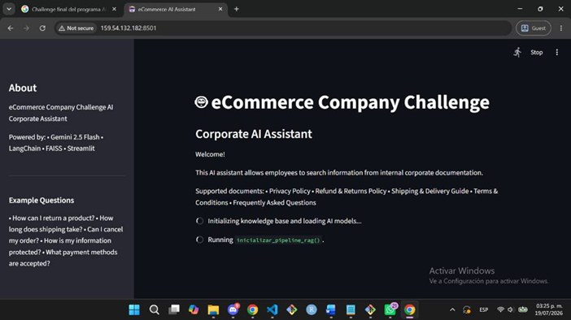

#### 1️⃣3️⃣ Main User Interface (Dashboard Status)
*The Streamlit web application fully rendered on the production server, displaying an active chat input box ready for user queries.*
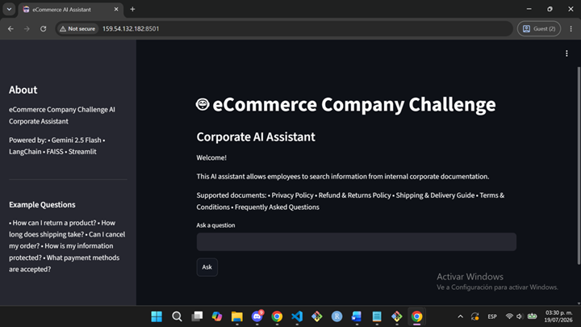

#### 1️⃣4️⃣ Successful Query Processing (Desktop View)
*The RAG agent responding in real-time to the query "Do you offer international shipping?", accurately extracting context from internal PDFs using Gemini 2.5 Flash.*
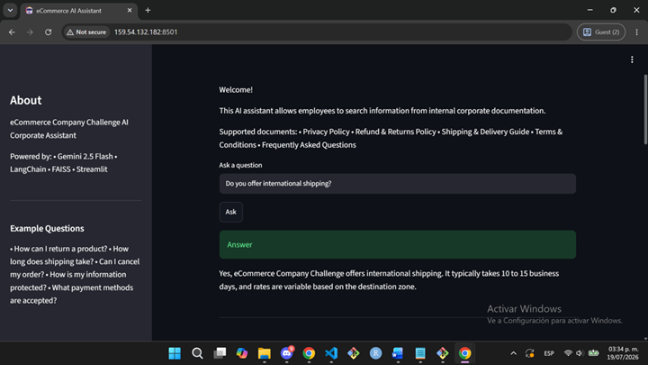

#### 1️⃣5️⃣ Source Citation & Conversation History Audit
*System transparency section displaying the exact PDF documents and pages retrieved from the FAISS vector database to build the response context.*
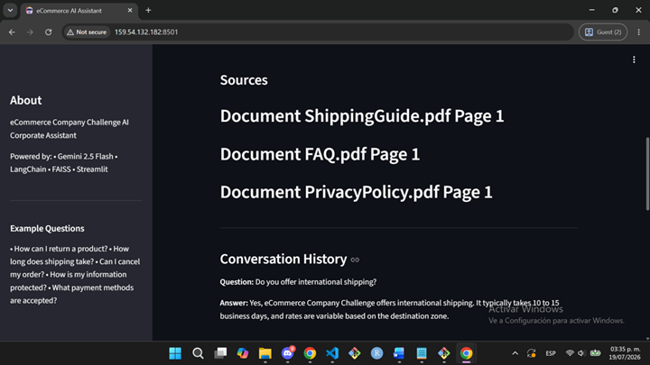

#### 1️⃣6️⃣ Mobile Interface Layout (Responsiveness)
*Proof of correct layout rendering and responsive design architecture on smartphone browsers, ensuring corporate accessibility on the go.*
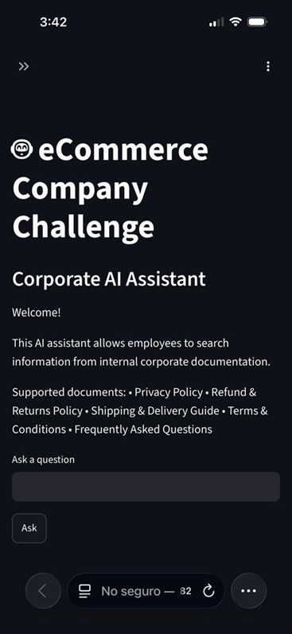

#### 1️⃣7️⃣ Live Mobile Query Execution
*Demonstration of the chatbot delivering structured, bulleted responses on a mobile viewport while maintaining optimal readability.*
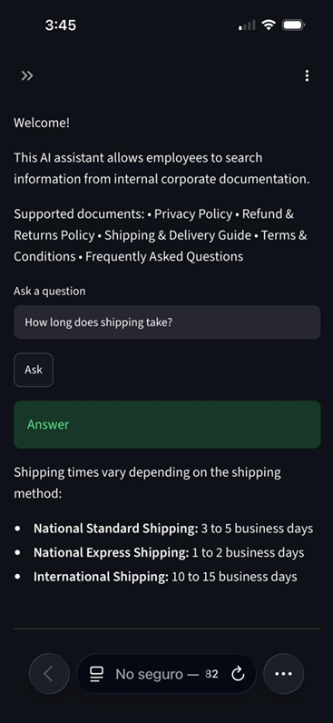

#### 1️⃣8️⃣ Out-of-Context Query Handling (Hallucination Mitigation)
*An example of the system securely processing an unsupported query. The agent gracefully refuses to answer based on document absence, completely mitigating AI hallucinations.*
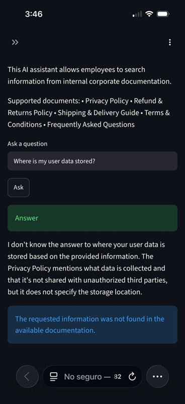

### 💡 Production-Grade Recommendations for Unanswered Queries
In enterprise environments, a RAG agent safely declaring *"I don't know"* or triggering a fallback mechanism is a critical safety threshold. This strict constraint strictly prevents **AI hallucinations** that could otherwise expose a company to regulatory, compliance, or commercial liabilities.

#### 🛠️ Real-World Mitigation Workflow
1. **Automated Query Logging (Feedback Loop):** Connect the agent's fallback triggers to external telemetry databases (e.g., AWS DynamoDB or Supabase). Capturing "not found" queries reveals exactly what information is missing from internal document stacks.
2. **Continuous Vector Store Optimization:** Leverage log insights to continuously draft and append new descriptive clauses into the raw source documents (e.g., updating the `Privacy Policy` to explicitly document physical server locations) and re-index the FAISS vector repository.
3. **Human-in-the-Loop Escalation:** Implement a direct routing action within the Streamlit frontend UI (such as a webhook connecting to Slack, Jira Service Desk, or Zendesk) to automatically escalate unresolved AI conversations to human HR or customer support representatives.